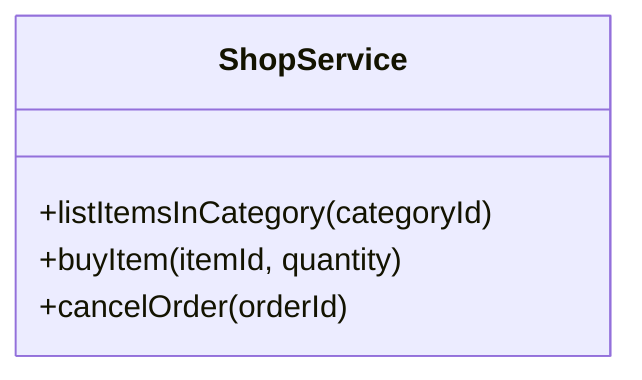
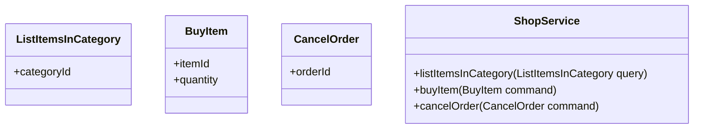
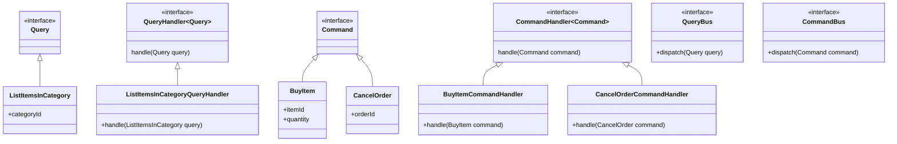
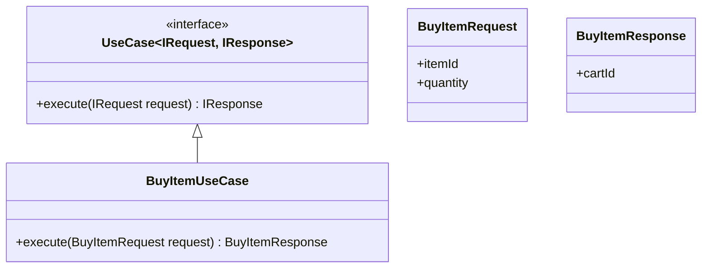

# La couche Application

TODO

# Implémentation

Au cours de mes différentes lectures, j'ai repéré plusieurs d'implémenter les
services de la couche Application.

## Service

Un service sert de façade. Chaque méthode de ce service correspond à un Use
Case.

Même si cela n'est pas explicite dans cette implémentation, les différents Use
Cases sont bien soit des _commandes_, soit des _requêtes_.

## Service avec commandes et requêtes

Il s'agit d'une variation de l'implémentation précédente qui fait apparaître de
manière plus explicite les _commandes_ et _requêtes_.

## Bus de commandes et bus de requêtes

Cette implémentation utilise un bus pour le traitement des commandes et
requêtes avec chaque `CommandHandler` ou `QueryHandler` représentant un Use
Case. Cette implémentation est plus complexe mais expose le bus comme un port,
ce qui permet d'en avoir plusieurs implémentations (en mémoire, avec un système
de messaging) et/ou de l'étendre avec des fonctionnalités supplémentaires
(logging, etc.).

## Use Case

Cette implémentation fait apparaître de manière explicite les Use Cases.

