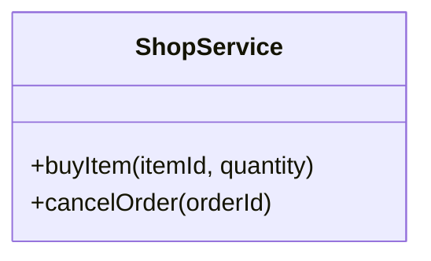
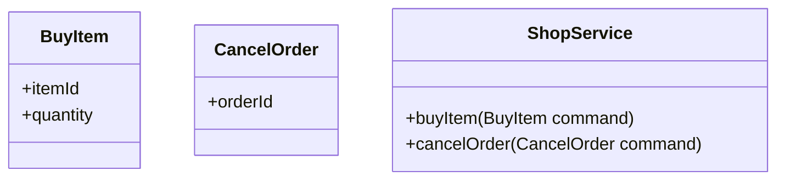

# Command

Au cours de mes différentes lectures, j'ai repéré plusieurs façons d'organiser
la partie **Command** d'une application.

## Service

Un service sert de façade. Chaque méthode de ce service correspond à un Use
Case.



## Service avec commande

Il s'agit d'une variation de l'implémentation précédente qui fait apparaître de
manière plus explicite les commandes.



## CommandBus

Cette implémentation utilise un bus pour le traitement des commandes avec chaque
`CommandHandler` représentant un Use Case. Cette implémentation est plus
complexe mais expose le bus comme un port, ce qui permet d'en avoir plusieurs
implémentations (en mémoire, avec un système de messaging) et/ou de l'étendre
avec des fonctionnalités supplémentaires (logging, etc.).

```mermaid
classDiagram
  class Command {
    <<interface>>
  }

  class CommandHandler~Command~ {
    <<interface>>
    handle(Command command)
  }

  class BuyItem {
    +itemId
    +quantity
  }
  Command <|-- BuyItem

  class BuyItemCommandHandler {
    +handle(BuyItem command)
  }
  CommandHandler <|-- BuyItemCommandHandler
  
  class CancelOrder {
    +orderId
  }
  Command <|-- CancelOrder

  class CancelOrderCommandHandler {
    +handle(CancelOrder command)
  }
  CommandHandler <|-- CancelOrderCommandHandler
  
  class CommandBus {
    <<interface>>
    +dispatch(Command command)
  }
````